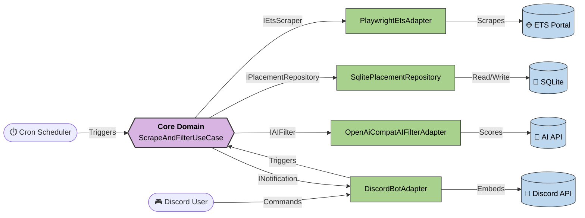

# FlexPlus Scraper

A headless Node.js microservice that automates scraping the ETS Placement Flex portal. It extracts job postings, scores their relevance using AI (OpenAI-compatible APIs like Gemini/Groq), and sends interactive notifications to Discord. 

## Features
- **Automated Scraping**: Uses Playwright with persistent browser contexts to bypass ADFS SSO and extract job details.
- **AI Relevance Filtering**: Scores postings based on a candidate profile. Falls back to a secondary AI provider if the primary fails.
- **Interactive Discord Notifications**: Sends rich embed alerts with direct "Quick Apply" buttons.
- **MFA Flow via Discord**: Automatically detects session expiration and prompts the user on Discord to approve MFA on their phone.
- **Hexagonal Architecture**: Strict separation of concerns ensuring domain logic is isolated from external dependencies (DB, UI, APIs).

## Architecture

This project strictly adheres to Hexagonal Architecture (Ports and Adapters):



## Installation & Setup

We recommend running this service via Docker to avoid OS-level Playwright and dependency issues.

1. **Clone the repository:**
   ```bash
   git clone <repo-url>
   cd FlexPlus
   ```

2. **Configure Environment:**
   Copy the example config and fill in your credentials.
   ```bash
   cp .env.example .env
   ```
   *Required variables:*
   - `ETS_EMAIL` & `ETS_PASSWORD`
   - `DISCORD_BOT_TOKEN`, `DISCORD_CHANNEL_ID`, & `DISCORD_ALLOWED_USERS`
   - `AI_API_KEY` (Defaults to Gemini API)

3. **Deploy using Docker Compose:**
   Start the production daemon in the background.
   ```bash
   docker compose up -d --build
   ```

4. **Initial Authentication:**
   - Watch the Discord channel. The bot will notify you when it needs MFA approval. 
   - Click "Prêt pour le MFA", approve the prompt on your phone matching the code provided by the bot.

## Usage (Discord Commands)

Authorized users (defined in `DISCORD_ALLOWED_USERS`) can control the bot directly from Discord:
- `!status` - Check if the scraper is running, standby, or requires MFA.
- `!run` - Manually force a scrape cycle immediately.
- `!auth` - Force a session wipe and restart the MFA process.
- `!help` - Display available commands.

## Troubleshooting

| Issue | Cause & Solution |
|-------|------------------|
| **Bot replies twice to `!status`** | The bot token is running in two environments simultaneously. Ensure you don't have the script running locally and in Docker at the same time. If lost, reset the Discord Bot Token in the Developer Portal. |
| **Chromium crashing in Docker** | Ensure your Docker host provides enough shared memory. The `docker-compose.yml` sets `shm_size: "512mb"` and `SYS_ADMIN` capabilities which are required for Chromium to run smoothly. |
| **"Target page, context or browser has been closed"** | ADFS timeout or the Playwright session crashed. Run `!auth` in Discord to clear the corrupted session and force a fresh login. |
| **MFA code not showing up on phone** | The ETS ADFS portal timed out waiting for the prompt. Click "Prêt pour le MFA" again in Discord or use `!auth` to restart the flow. |
| **TypeScript Build Errors (`npx.ps1` restricted)** | If you receive PowerShell execution policy errors locally, build using `npm run build` instead of relying on `npx` directly. |
